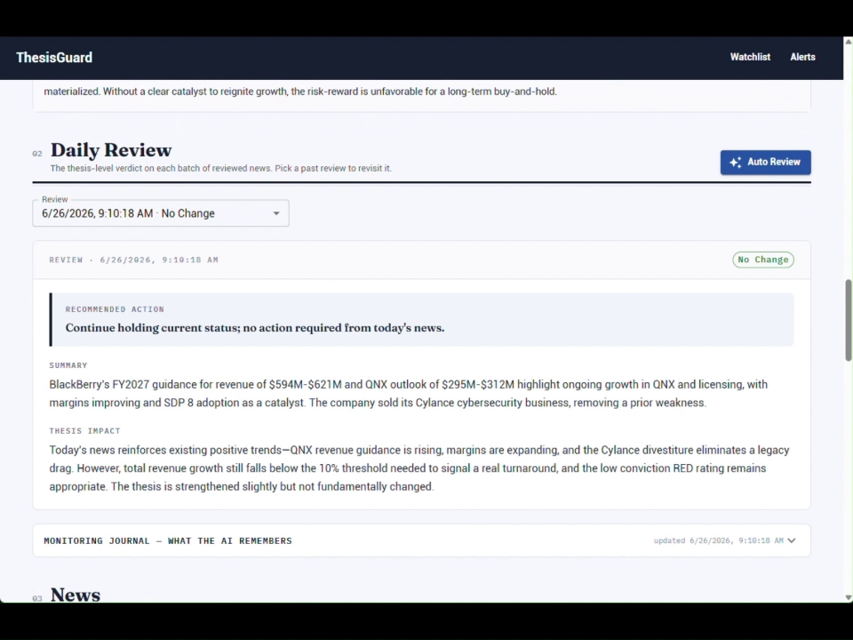
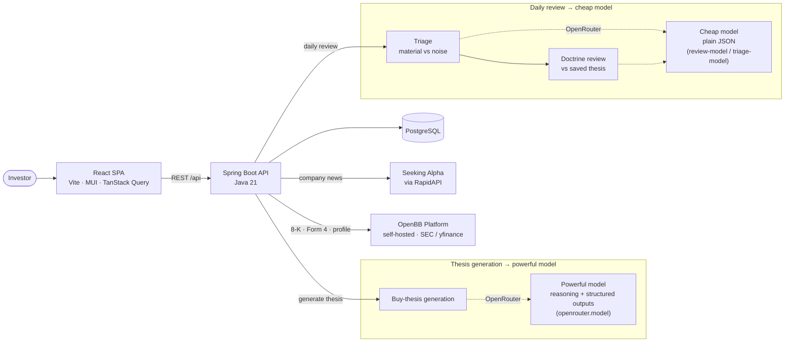
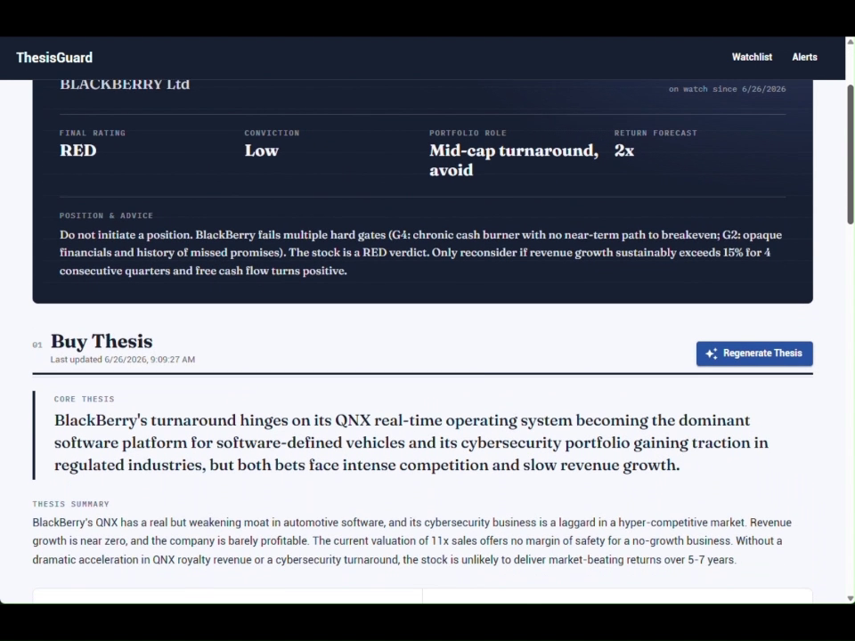
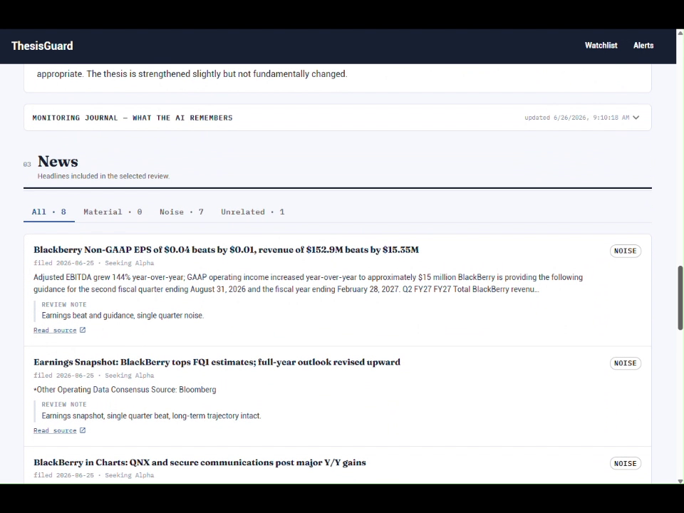

# ThesisGuard — API (Backend)

[](https://thesisguard.kingheung.com)


> **An AI-powered stock-thesis monitoring platform for long-term investors.** Add a stock, generate an AI buy thesis, then let a daily **two-stage AI review** weigh fresh news, SEC 8-K filings and insider trades against it — escalating the stock's status and raising an alert when the thesis materially changes.

**🔗 Live demo:** [thesisguard.kingheung.com](https://thesisguard.kingheung.com)  ·  **Frontend repo:** [thesisguard-app](https://github.com/billtam823/thesisguard-app)  ·  this repo is the **Spring Boot backend**.



## Highlights

- **Two-stage AI review pipeline** — a cheap *triage* model filters market noise first, so the expensive *doctrine review* only reads news that could actually move the long-term thesis. Fails safe: if triage can't run, every item is reviewed.
- **Cross-day monitoring journal** — an AI-maintained digest tied to each thesis's kill-criteria and watch items, carried into every future review so multi-day developments are judged in context, not in isolation.
- **Real SEC EDGAR data, zero API key** — per-ticker 8-K filings and Form 4 insider trades pulled live and translated into human-readable summaries the AI can reason over.
- **Structured-output model routing** — thesis generation requires both `structured_outputs` and `reasoning`, so OpenRouter only routes to capable models; the lighter review/triage calls use plain JSON for flexibility.
- **Clone-and-run with no keys** — a `MockAiClient` fallback (`@ConditionalOnMissingBean`) drives the entire flow without any paid API key.
- **Production-deployed** — multi-stage Docker image, Dokploy + Traefik path routing, `/actuator/health` checks, and a same-origin frontend (no CORS preflight in prod).

## Architecture



## Screenshots

<table>
  <tr>
    <td width="50%"><br><sub><b>AI-generated buy thesis</b> — rating, conviction, portfolio role, pillars and the full document.</sub></td>
    <td width="50%"><br><sub><b>Triage in action</b> — every item tagged Material / Noise / Unrelated before the expensive review.</sub></td>
  </tr>
</table>

## System overview

ThesisGuard is a stock investment thesis management system for long-term buy-and-hold monitoring. It has two parts:

- **thesisguard-api** — Spring Boot backend (this repository), serving a REST API on `http://localhost:8080`
- **thesisguard-app** — React (Vite + MUI + TanStack Query) frontend in `../thesisguard-app`, served on `http://localhost:5173`

The core workflow: add a stock to the watchlist → generate an AI buy thesis → collect news, SEC 8-K filings, and insider trades for it → run a daily AI review that judges whether the day's saved news materially changes the thesis → escalate the stock's status and raise an alert when it does.

## Current Scope

Implemented:

- Watchlist stock CRUD with exchange auto-detection via OpenBB
- AI-generated buy thesis (OpenRouter) with manual editing
- Company news from Seeking Alpha (via RapidAPI); newsfilter.io, Finnhub, and OpenBB's yfinance news client remain as unwired fallbacks
- Live SEC EDGAR previews from OpenBB (sec provider): per-ticker 8-K filings and Form 4 insider trades
- Daily news item save/retrieval
- Daily AI news review against the saved thesis
- Stock status escalation based on thesis impact
- Alert creation and resolution
- Mock AI client fallback for running without an API key
- React frontend (watchlist, stock dossier page, alerts)
- PostgreSQL persistence, DTO-based REST API, validation, global error handling

- Scheduled automatic news fetch (ingest-only) twice a day; reviews stay user-triggered
- Cheap AI triage that filters breaking news from noise before the expensive review

Not implemented yet:

- Authentication or multi-user support
- Automated (scheduled) reviews — fetching is automated, but reviews are user-triggered
- Financial scoring, backtesting, deployment automation
- Database migrations (schema is Hibernate `ddl-auto: update`)

## Tech Stack

- Java 21, Spring Boot 3.5.14, Maven
- Spring Web, Spring Data JPA, Bean Validation, Lombok
- PostgreSQL (runtime), H2 in PostgreSQL mode (tests)
- OpenBB Platform REST API — **your own self-hosted instance** (deploy it yourself; secured with per-client `x-api-key` auth) for market data, SEC filings, and insider trades
- Seeking Alpha via RapidAPI (`seeking-alpha-finance.p.rapidapi.com`) for company news
- OpenRouter (`https://openrouter.ai/api/v1`) for AI generation
- Frontend: React 18, Vite, MUI, TanStack Query, axios, react-router

## Package Structure

```text
com.thesisguard
+-- ai                  # AiClient interface, OpenRouterAiClient, MockAiClient fallback
+-- alert               # Alert entity, DTOs, repository, service, controller
+-- common.exception    # ApiException hierarchy and global error handler
+-- config              # CORS config (allows localhost:5173)
+-- news                # News item entity/CRUD + live OpenBB previews (news, 8-K filings, insider trades)
+-- openbb              # OpenBbClient wrapping the OpenBB Platform REST API
+-- review              # Daily review and news analysis entities/workflow
+-- stock               # Watchlist stock entity/workflow
+-- thesis              # Saved stock thesis entity/workflow
```

## Stock Code Model

`Stock` carries three related identifiers:

- `ticker` — base symbol (e.g. `NVDA`, `RY`)
- `exchange` — friendly exchange name (e.g. `NASDAQ`, `TSX`); auto-populated from the OpenBB equity profile on creation when not supplied
- `provider_ticker` — computed: US exchanges (NASDAQ, NYSE, AMEX, NYSE ARCA) return the bare ticker; others append the exchange (`RY:TSX`)

`Stock.isUsListed()` gates SEC EDGAR features: stocks on non-US exchanges return empty results from the filings/insider endpoints, since EDGAR only covers US-listed companies.

All stock-scoped endpoints take `{stockCode}`, which resolves as either a numeric database ID or a ticker symbol.

## AI Layer

`AiClient` has two implementations selected at startup:

- **`OpenRouterAiClient`** — active when `openrouter.api-key` is set. Calls the OpenRouter chat completions API with three configurable models: `openrouter.model` for buy thesis generation, `openrouter.review-model` for the daily doctrine review, and `openrouter.triage-model` (a cheap model; defaults to the review model) for the news triage pre-filter. Prompts live in `src/main/resources/prompts/` (system prompts + user templates for all flows). Markdown code fences are stripped from responses before JSON parsing.
- **`MockAiClient`** — fallback via `@ConditionalOnMissingBean` when no key is set. For reviews it maps news-title keywords to change levels: `watch` → Watch Change, `material` → Material Change, `broken` → Thesis Broken, `minor` → Minor Change, otherwise No Change. Its triage marks titles containing those keywords (plus `fraud`/`recall`/`lawsuit`/`guidance cut`) as material, the rest as noise.

The triage step is a cheap first pass: it classifies each pending news item as **material** (could affect the long-term thesis) or **noise**, so the expensive doctrine review only runs on — and only reads — the material items. Triage fails safe: if it cannot run, every item is treated as material. Disable it with `thesisguard.triage.enabled: false` to review every item.

## Model Configuration

The three OpenRouter models are set under `openrouter:` in `application.yaml`, or — preferably for deployments — overridden via environment variables:

| Property | Env var | Used for |
| --- | --- | --- |
| `openrouter.model` | `OPENROUTER_MODEL` | Buy-thesis generation |
| `openrouter.review-model` | `OPENROUTER_REVIEW_MODEL` | Daily doctrine review |
| `openrouter.triage-model` | `OPENROUTER_TRIAGE_MODEL` | News triage pre-filter (defaults to review-model) |

**The thesis model has a hard requirement.** The thesis call sends a strict `json_schema` (structured outputs) **and** a `reasoning` parameter with `require_parameters: true`, so OpenRouter only routes to a model that supports **both** `structured_outputs` and `reasoning`. The review/triage calls send `json_object` (plain JSON), which most models support, so those are more flexible.

Before switching the thesis model, confirm the candidate supports both — browse [openrouter.ai/models](https://openrouter.ai/models), or check the model's endpoints:

```bash
curl https://openrouter.ai/api/v1/models/<author>/<slug>/endpoints
# supported_parameters must include: structured_outputs, response_format, reasoning, include_reasoning
```

### Suggested models (structured outputs + reasoning)

| Model | ~Input cost / 1M tokens | Notes |
| --- | --- | --- |
| `deepseek/deepseek-v4-flash` | ~$0.09 | Cheapest that qualifies; current default |
| `google/gemini-3.1-flash-lite` | ~$0.25 | Google-stable alternative |

**On free models:** no current free model supports both structured outputs *and* reasoning, so a $0 thesis model isn't possible without relaxing the code — and free models rotate out without notice (the former default `google/gemini-2.0-flash-exp:free` was pulled, which is what made the default a cheap paid model). Review/triage can still point at a free model if one is available, since they only need plain JSON. Browse free options at [openrouter.ai/models?max_price=0](https://openrouter.ai/models?max_price=0).

## News & OpenBB Integration

**Company news comes from Seeking Alpha via RapidAPI.** `SeekingAlphaClient` calls `GET /v1/symbols/news` on `seeking-alpha-finance.p.rapidapi.com` (header auth via `x-rapidapi-key`), mapping the JSON:API response into `FetchedNewsItemResponse`. It needs `seekingalpha.api-key` (a RapidAPI key); without a key, company-news fetches return empty (SEC filings/insider still work). An optional AI web-search collector (`AiNewsSearchClient`) can supplement it but is disabled by default (`thesisguard.ai-news-search.enabled`). `NewsfilterClient`, `FinnhubClient`, and `OpenBbClient.fetchCompanyNews` (yfinance) remain in the codebase as unwired fallbacks.

`OpenBbClient` wraps these OpenBB Platform REST endpoints:

| Method | OpenBB endpoint | Provider | Used for |
| --- | --- | --- | --- |
| `fetchExchange` | `/api/v1/equity/profile` | yfinance | Exchange auto-detection on stock creation |
| `fetchCompanyNews` | `/api/v1/news/company` | yfinance | *(kept, unused — news now via Seeking Alpha)* |
| `fetchCompanyFilings` | `/api/v1/equity/fundamental/filings` | sec | 8-K filings preview (form_type=8-K) |
| `fetchInsiderTrading` | `/api/v1/equity/ownership/insider_trading` | sec | Form 4 insider trades preview |

The SEC provider needs no API key — it reads straight from EDGAR. SEC results are mapped into the same preview shape as news (`FetchedNewsItemResponse`, source `SEC EDGAR`):

- **8-K filings** — item codes are translated to readable descriptions (e.g. `2.02` → "Results of Operations and Financial Condition") so titles are meaningful to the AI reviewer; links point to the EDGAR filing index.
- **Insider trades** — each Form 4 transaction becomes a sentence, e.g. *"Insider transaction (Form 4): GAWEL SCOTT (Principal Accounting Officer) acquired 45,643 shares of Common Stock"*, with transaction type, post-transaction holdings, and footnotes in the summary.

Previews are read-only; nothing is stored until the user saves an item as a news item. Saved items default to today's `published_date`, which is the date the daily review scans.

## Daily Review Workflow

News accumulates in the backlog (unreviewed items) as it is ingested. A review processes the
whole accumulated group at once. `POST /api/stocks/{stockCode}/review-news`:

1. Load the stock and its saved thesis (404 if no thesis).
2. Load the pending (unreviewed) news items for the stock.
3. No pending news → save a review with `No News Found`, skip the AI call.
4. **Triage** the group (cheap model) into *material* vs *noise*:
   - **All noise** → save a `No Change` review noting nothing affects the long-term thesis; no expensive call, no memory update, no alert. Every item is marked reviewed.
   - **Some material** → send stock + thesis + the *material* items to `AiClient.reviewNews`, save the `DailyNewsReview` with per-item `NewsAnalysisItem` rows (noise items recorded as `NOISE` at no extra cost), update the monitoring memory.
5. Escalate `Stock.status` and raise alerts:

| Thesis Change Level | Stock Status Action | Alert |
| --- | --- | --- |
| No Change | Keep current status | No |
| Minor Change | Keep current status | No |
| Watch Change | Set status to `Watch` | Yes |
| Material Change | Set status to `Reduce Review` | Yes |
| Thesis Broken | Set status to `Sell Review` | Yes |
| No News Found | Keep current status | No |

`StockStatus` and `ThesisChangeLevel` serialize with human-readable labels (`"Hold"`, `"Watch Change"`, `"Thesis Broken"`) rather than enum constant names.

## Entity Relationships

```text
Stock ──1:1──> StockThesis
     ──1:N──> NewsItem
     ──1:N──> DailyNewsReview ──1:N──> NewsAnalysisItem ──N:1──> NewsItem
     ──1:N──> Alert ──N:1──> DailyNewsReview (optional)
```

All relationships are lazy; cascades (`ALL` + orphan removal) flow parent → child.

## REST APIs

### Stock

- `POST /api/watchlist/stocks` — add a stock (`ticker`, `companyName`, optional `exchange`; exchange auto-detected via OpenBB when omitted; ticker uppercased; duplicates rejected; default status `Hold`)
- `GET /api/watchlist/stocks` — list watchlist
- `GET /api/watchlist/stocks/{stockCode}` — get one stock
- `DELETE /api/watchlist/stocks/{stockCode}` — remove (DB-cascade deletes related rows)

### Thesis

- `POST /api/stocks/{stockCode}/generate-thesis` — generate via AI; creates or replaces the saved thesis
- `GET /api/stocks/{stockCode}/thesis` — get saved thesis (404 if none)
- `PUT /api/stocks/{stockCode}/thesis` — manual full update

### News (saved items)

- `POST /api/stocks/{stockCode}/news` — save a news item (`title` required; `published_date` defaults to today)
- `POST /api/stocks/{stockCode}/news/ingest` — ingest-only: fetch latest headlines/filings/insider trades and store new ones (no review); returns `new_items_count`. Also run automatically by the scheduler.
- `GET /api/stocks/{stockCode}/news` — all saved news, newest first
- `GET /api/stocks/{stockCode}/news/today` — saved news dated today

### News (live previews — no DB write)

- `GET /api/stocks/{stockCode}/news/fetch?date=` — company news headlines from Seeking Alpha
- `GET /api/stocks/{stockCode}/news/filings?date=` — SEC 8-K filings (all recent when `date` omitted; empty for non-US stocks)
- `GET /api/stocks/{stockCode}/news/insider?date=` — SEC Form 4 insider trades (recent transactions when `date` omitted; empty for non-US stocks)

### Review

- `POST /api/stocks/{stockCode}/review-news` — run today's review (workflow above)
- `GET /api/stocks/{stockCode}/daily-reviews` — all reviews, newest first, with per-item analysis
- `GET /api/stocks/{stockCode}/daily-reviews/latest` — latest review (404 if none)

### Alerts

- `GET /api/alerts` — all alerts, newest first
- `GET /api/stocks/{stockCode}/alerts` — alerts for one stock
- `PUT /api/alerts/{alertId}/resolve` — mark resolved (sets `resolved_at`)

### Error Handling

Errors return through `@RestControllerAdvice`: missing stock/thesis/review → `404`; duplicate ticker or validation failure → `400` (with `field_errors`); OpenBB upstream failure → `502`; unexpected → `500`.

## Frontend (thesisguard-app)

Separate repo: https://github.com/billtam823/thesisguard-app

Talks to the API via `VITE_API_BASE_URL` (`.env`, default `http://localhost:8080`). Pages:

- **Watchlist** — all stocks with status chips; add/remove
- **Stock detail (`/stocks/{code}`)** — the "Equity Dossier":
  1. *Buy Thesis* — generate/regenerate, core thesis, pillars, risk panel, full document
  2. *Daily Review* — the thesis-level verdict: change-level chip, recommended action, summary, thesis impact, and the AI monitoring journal (per-article classification lives in the feed below)
  3. *News* — "Fetch Latest" ingests headlines (and filings) straight into the review backlog (no manual save), with **All / Material / Noise / Pending** filter tabs and each item's review classification shown inline
  4. *Filings* — the SEC 8-K / Form 4 insider slice of the backlog (`source = "SEC EDGAR"`), with the same filter tabs and inline classification
  5. *Alerts* — per-stock alert list with resolve buttons
- **Alerts** — global alert feed

Run with `npm run dev` (port 5173); `npm run build` typechecks and bundles.

## Configuration

`src/main/resources/application.yaml`:

```yaml
spring:
  datasource:
    url: jdbc:postgresql://localhost:5432/thesisguard
    username: thesisguard_app
    # password lives in application-local.yaml (gitignored); must match POSTGRES_PASSWORD in .env
  jpa:
    hibernate:
      ddl-auto: update     # no migration files; Hibernate manages schema

openbb:
  # Your own self-hosted OpenBB instance. Set the real base-url + api-key in application-local.yaml.
  base-url: https://your-openbb-instance.example.com
  # api-key (per-client key matching the server's OPENBB_API_KEYS) lives in application-local.yaml.

seekingalpha:
  host: seeking-alpha-finance.p.rapidapi.com
  # api-key (a RapidAPI key) lives in application-local.yaml; without it, company-news fetches return empty.

openrouter:
  model: <model for thesis generation>
  review-model: <model for the daily doctrine review>
  triage-model: <cheap model for the news triage pre-filter; defaults to review-model>

thesisguard:
  triage:
    enabled: true          # false = review every item, skipping the triage pre-filter
  ai-news-search:
    enabled: false         # optional AI web-search news supplement (off by default)
  news-fetch:                # automatic ingest-only fetch; empty crons disables it
    zone: America/New_York   # US market timezone (ET)
    crons:
      - "0 0 9 * * MON-FRI"    # pre-market fetch (09:00 ET)
      - "0 0 12 * * MON-FRI"   # lunch fetch (12:00 ET)
```

The scheduled fetch only **ingests** news into the backlog; reviews remain user-triggered (run `POST .../review-news` when you want the day's grouped judgment).

Local-only config and secrets are **not** committed. Put them in `application-local.yaml` at the repo root (gitignored, loaded via `spring.config.import`). This includes **your own OpenBB instance URL** (`openbb.base-url`) and its per-client `openbb.api-key` (must match the server's `OPENBB_API_KEYS`) — keeping your instance URL out of the tracked repo. Omit the OpenRouter key to fall back to `MockAiClient`, and omit the Seeking Alpha key to have company-news fetches return empty. The local Postgres password also lives here:

```yaml
spring:
  datasource:
    password: <your local postgres password>   # must match POSTGRES_PASSWORD in .env
openbb:
  base-url: https://your-openbb-instance.example.com   # your self-hosted OpenBB instance
  api-key: <this client's OpenBB API key>
openrouter:
  api-key: <your openrouter key>
seekingalpha:
  api-key: <your rapidapi key>
```

`docker-compose.yml` reads the same password from a gitignored `.env` file at the repo root:

```bash
POSTGRES_PASSWORD=<your local postgres password>
```

Tests swap the datasource to H2 (`MODE=PostgreSQL`, `ddl-auto: create-drop`) via `src/test/resources/application.yaml` — no Docker needed.

## Local Run

First create the two gitignored secrets files at the repo root (see [Configuration](#configuration)): `.env` with `POSTGRES_PASSWORD=...` (read by `docker-compose`) and `application-local.yaml` with the matching `spring.datasource.password` plus your API keys.

```bash
# Start PostgreSQL (reads POSTGRES_PASSWORD from .env)
docker compose up -d

# Run the API (Windows: .\mvnw.cmd spring-boot:run)
./mvnw spring-boot:run

# Run tests
./mvnw test

# Frontend (in ../thesisguard-app)
npm run dev
```

## Deploy to Dokploy

The app ships a multi-stage `Dockerfile` (builds the jar, runs it on port `8080`). Neither
`application-local.yaml` nor `.env` is baked into the image (both are in `.dockerignore`), so **all
config comes from environment variables** — Spring Boot relaxed binding maps `A_B_C` → `a.b.c`
(and accepts `_` in place of `-`, so `OPENBB_BASE_URL` → `openbb.base-url`).

Topology: one Dokploy project with a managed **PostgreSQL** service and an **Application** built
from this repo's Dockerfile. OpenBB stays self-hosted externally; OpenRouter and Seeking Alpha are
external APIs (keys only).

### Environment variables (set in the Application's env settings)

| Env var | Value |
|---|---|
| `SPRING_DATASOURCE_URL` | `jdbc:postgresql://<dokploy-db-internal-host>:5432/thesisguard` |
| `SPRING_DATASOURCE_USERNAME` | `thesisguard_app` |
| `SPRING_DATASOURCE_PASSWORD` | the password set on the Dokploy Postgres service |
| `OPENROUTER_API_KEY` | OpenRouter key (enables `OpenRouterAiClient`; without it, `MockAiClient` is used) |
| `SEEKINGALPHA_API_KEY` | RapidAPI key (without it, company-news fetches return empty) |
| `OPENBB_BASE_URL` | your self-hosted OpenBB instance, e.g. `https://openbb.kingheung.com` |
| `OPENBB_API_KEY` | OpenBB client key (matches an entry in the server's `OPENBB_API_KEYS`) |

The free-model defaults (`google/gemini-2.0-flash-exp:free`) are committed in `application.yaml`, so
no `OPENROUTER_MODEL*` vars are needed for the demo. For production, override `OPENROUTER_MODEL`,
`OPENROUTER_REVIEW_MODEL`, and `OPENROUTER_TRIAGE_MODEL`.

### Steps

1. Create a project (e.g. `thesisguard`).
2. Create a **PostgreSQL** service: db `thesisguard`, user `thesisguard_app`, a strong password.
   Deploy it, then copy its **internal host**.
3. Create an **Application**: Git provider = this repo, branch = your deploy branch,
   Build Type = **Dockerfile**.
4. Add the environment variables above (DB internal host + password, plus the API keys).
5. Set the container **port** to `8080`; optionally attach a domain.
6. Set the **Health Check** to HTTP `GET /actuator/health` on port `8080`.
7. **Deploy.** Watch the build logs; once up, `GET /actuator/health` returns `{"status":"UP"}`.

Schema is created automatically on first boot (Hibernate `ddl-auto: update`) against the empty
Dokploy database — no migration files.

## Example Curl Flow

```bash
# Add NVDA (exchange auto-detected from OpenBB)
curl -X POST http://localhost:8080/api/watchlist/stocks \
  -H "Content-Type: application/json" \
  -d '{"ticker":"nvda","companyName":"NVIDIA Corporation"}'

# Generate thesis
curl -X POST http://localhost:8080/api/stocks/NVDA/generate-thesis

# Preview today's headlines / SEC filings / insider trades (no DB write)
curl "http://localhost:8080/api/stocks/NVDA/news/fetch?date=2026-06-12"
curl "http://localhost:8080/api/stocks/NVDA/news/filings"
curl "http://localhost:8080/api/stocks/NVDA/news/insider"

# Save a news item for today's review
curl -X POST http://localhost:8080/api/stocks/NVDA/news \
  -H "Content-Type: application/json" \
  -d '{"title":"NVDA watch risk emerges around export restrictions","summary":"...","url":"https://example.com/nvda"}'

# Run today's review, then read it
curl -X POST http://localhost:8080/api/stocks/NVDA/review-news
curl http://localhost:8080/api/stocks/NVDA/daily-reviews/latest

# Alerts
curl http://localhost:8080/api/alerts
```
